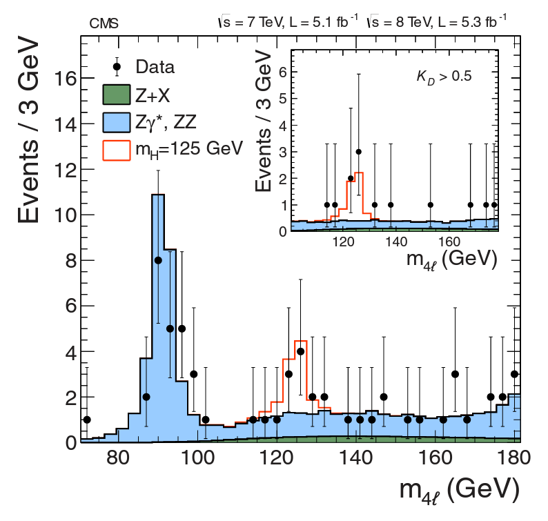

# higgs_boson

## Presentation (Preview) README

The goal with this project/visualization was twofold.

### Part 1

Use real data from CMS (one of the experiments involved in the discovery of the Higgs Boson) to recreate the discovery. For the discovery, particles which participated early on in the collision (_parent particles_) were reconstructed from particles into which they decayed (_daughter particles_). By looking at the mass and velocity of the daughter particles and using an invariant mass formula from relativity, we can find the invariant mass of the parent particle. This invariant mass includes its total mass-energy (remember, $E = m c^2$). This can be thought of as the mass of the parent particle along with the energy coming from its velocity. Because of the way we take the measurements (in what we call the center-of-mass frame), the values of the invariant mass will most-frequently be close to the mass itself (as if there were no velocity). 

This was done by following the example of [this guide](https://opendata-education.github.io/en_Workshops/exercises/Hunting-the-Higgs-4leptons.html) ([archived](https://web.archive.org/web/20230404213834/https://opendata-education.github.io/en_Workshops/exercises/Hunting-the-Higgs-4leptons.html)). That recreation of the discovery included getting and understanding data about the physics processes we understand, especially particles with masses close to the mass of our theorized Higgs (and processes which end up involving such masses). We often call this the QCD Background. I discuss some extra details about specific particles and processes, and I also discuss the use of Monte-Carlo simulations to allow the inclusion of the correct background for the amount of collisions we have in the data.

Basically, this part of the project involved trying to get a plot looking something like the discovery plot for the Higgs

 

  

 

using data that can be represented like this

The good news is that such a plot was realized. Here it is, in all its glory.

Go ahead and check out the Jupyter Notebook to see how this journey was made. Try it yourself!

@TODO links, MyBinder

### Part 2

Use some of my knowledge, gained while working in high-energy physics research while getting a M.S. Physics, to find other interesting ways of looking at the data. This included what I call "sanity checks" - validation that nothing in our steps nor in our data violates physics. The most interesting of these involved looking at the invariant masses of individual particles. That led to some debugging to rid myself of some crazy values and some lessons about how to create functions that are `Pandas` and `NumPy` friendly.

